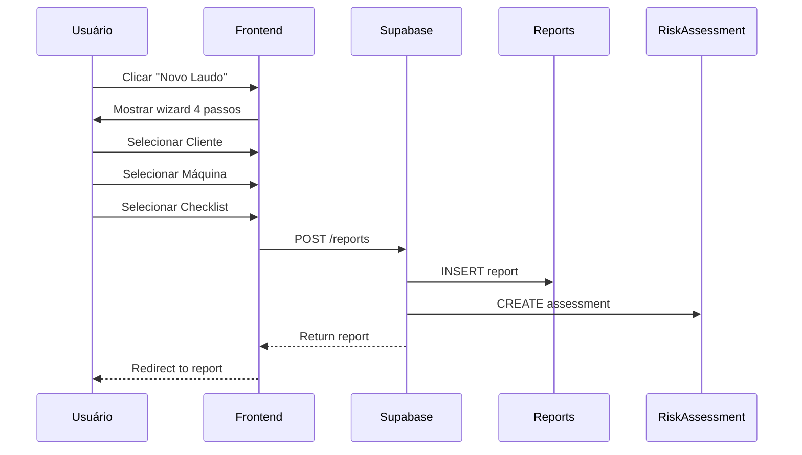
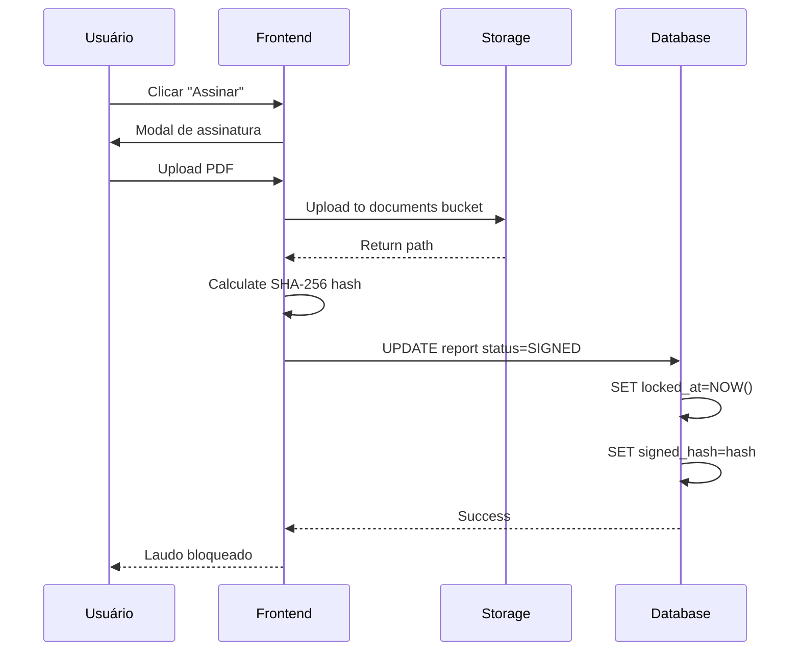
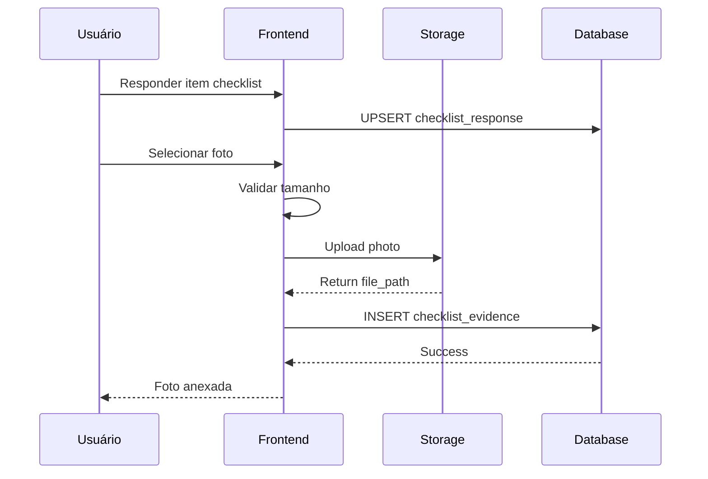

# Documentação Técnica - NR-12 Safety Inspector

## 📋 Sumário

1. [Arquitetura do Sistema](#arquitetura-do-sistema)
2. [Stack Tecnológico](#stack-tecnológico)
3. [Estrutura de Diretórios](#estrutura-de-diretórios)
4. [Modelo de Dados](#modelo-de-dados)
5. [API e Endpoints](#api-e-endpoints)
6. [Autenticação e Autorização](#autenticação-e-autorização)
7. [Componentes React](#componentes-react)
8. [Repositórios e Data Access](#repositórios-e-data-access)
9. [Fluxos de Trabalho](#fluxos-de-trabalho)
10. [Deploy e Infraestrutura](#deploy-e-infraestrutura)
11. [Segurança](#segurança)
12. [Performance](#performance)

---

## Arquitetura do Sistema

### Visão Geral

```
┌─────────────────────────────────────────────────────────────────┐
│                         CLIENTE (Browser)                        │
│                     React + TypeScript + Vite                    │
└─────────────────────────────────────────────────────────────────┘
                              │
                              │ HTTPS
                              ▼
┌─────────────────────────────────────────────────────────────────┐
│                         SUPABASE PLATFORM                        │
│  ┌──────────────┐  ┌──────────────┐  ┌──────────────────────┐  │
│  │   PostgreSQL │  │    Auth      │  │   Storage (S3)       │  │
│  │   (Dados)    │  │   (JWT)      │  │   (Arquivos)         │  │
│  └──────────────┘  └──────────────┘  └──────────────────────┘  │
└─────────────────────────────────────────────────────────────────┘
```

### Arquitetura de Camadas

```
src/
├── ui/                    # Camada de Apresentação
│   ├── components/        # Componentes reutilizáveis
│   ├── pages/            # Páginas/Telas
│   ├── layouts/          # Layouts (Dashboard, Auth)
│   └── hooks/            # Hooks customizados
│
├── infrastructure/        # Camada de Infraestrutura
│   ├── supabase/         # Cliente Supabase
│   └── repositories/     # Acesso a dados
│
├── domain/               # Camada de Domínio
│   ├── types.ts          # Tipos TypeScript
│   └── utils.ts          # Utilitários
│
└── App.tsx              # Ponto de entrada
```

---

## Stack Tecnológico

### Frontend

| Tecnologia | Versão | Propósito |
|------------|--------|-----------|
| React | 19.x | UI Library |
| TypeScript | 5.x | Tipagem estática |
| Vite | 6.x | Build tool |
| Tailwind CSS | 3.x | Estilização |
| TanStack Query | 5.x | Gerenciamento de estado server |
| React Router | 7.x | Roteamento |
| Lucide React | 0.x | Ícones |
| jsPDF | 2.x | Geração de PDF |
| html2canvas | 1.x | Captura de tela para PDF |

### Backend (Supabase)

| Serviço | Tecnologia | Propósito |
|---------|------------|-----------|
| Database | PostgreSQL 15 | Dados |
| Auth | GoTrue (JWT) | Autenticação |
| Storage | S3-compatible | Arquivos |
| Realtime | Elixir/Phoenix | Notificações ao vivo |

---

## Estrutura de Diretórios

```
nr12_kimi_implementacao/
├── src/
│   ├── App.tsx                    # Componente raiz
│   ├── main.tsx                   # Entry point
│   ├── domain/
│   │   ├── types.ts               # Interfaces e types
│   │   └── utils.ts               # Helpers
│   │
│   ├── infrastructure/
│   │   ├── supabase/
│   │   │   ├── client.ts          # Cliente Supabase
│   │   │   └── index.ts           # Exportações
│   │   ├── auth/
│   │   │   ├── AuthContext.tsx    # Contexto de auth
│   │   │   └── AuthProvider.tsx   # Provider
│   │   └── repositories/
│   │       ├── actionPlanRepository.ts
│   │       ├── auditRepository.ts
│   │       ├── checklistRepository.ts
│   │       ├── clientRepository.ts
│   │       ├── dashboardRepository.ts
│   │       ├── jobRepository.ts
│   │       ├── machineRepository.ts
│   │       ├── notificationRepository.ts
│   │       ├── reportRepository.ts
│   │       ├── riskRepository.ts
│   │       ├── siteRepository.ts
│   │       ├── tenantRepository.ts
│   │       └── trainingRepository.ts
│   │
│   └── ui/
│       ├── components/
│       │   ├── DataLoadingState.tsx
│       │   ├── GenerateReportPDFButton.tsx
│       │   ├── NotificationBell.tsx
│       │   ├── ReportLockBanner.tsx
│       │   ├── SafetyDistanceCalculator.tsx
│       │   ├── RBACGuard.tsx
│       │   └── UserManagement.tsx
│       │
│       ├── hooks/
│       │   ├── useRBAC.ts
│       │   └── useReportLock.ts
│       │
│       ├── layouts/
│       │   ├── AuthLayout.tsx
│       │   └── DashboardLayout.tsx
│       │
│       └── pages/
│           ├── audit/
│           │   └── AuditLogPage.tsx
│           ├── auth/
│           │   └── LoginPage.tsx
│           ├── clients/
│           │   ├── ClientFormModal.tsx
│           │   └── ClientsListPage.tsx
│           ├── dashboard/
│           │   ├── DashboardAlerts.tsx
│           │   ├── DashboardCharts.tsx
│           │   ├── DashboardPage.tsx
│           │   └── DashboardStats.tsx
│           ├── jobs/
│           │   └── JobsListPage.tsx
│           ├── machines/
│           │   ├── MachineFormModal.tsx
│           │   └── MachinesListPage.tsx
│           ├── reports/
│           │   ├── CreateReportModal.tsx
│           │   ├── ReportDetailsPage.tsx
│           │   ├── ReportOverview.tsx
│           │   ├── ReportsListPage.tsx
│           │   ├── signing/
│           │   │   ├── ReportIntegrityBadge.tsx
│           │   │   └── ReportSigningModal.tsx
│           │   ├── action-plan/
│           │   ├── checklist/
│           │   ├── risk/
│           │   └── validation/
│           ├── settings/
│           │   └── SettingsPage.tsx
│           ├── sites/
│           │   └── SitesListPage.tsx
│           └── training/
│               └── TrainingPage.tsx
│
├── database/                      # Migrations SQL
│   ├── add_audit_table.sql
│   ├── add_jobs_table.sql
│   ├── add_notifications_table.sql
│   ├── add_report_signing.sql
│   ├── add_rbac.sql
│   ├── add_sites_table.sql
│   ├── schema.sql
│   └── ...
│
├── docs/                          # Documentação
│   ├── MANUAL_USUARIO.md
│   └── DOCUMENTACAO_TECNICA.md
│
├── public/                        # Assets estáticos
├── index.html
├── package.json
├── tailwind.config.js
├── tsconfig.json
└── vite.config.ts
```

---

## Modelo de Dados

### Diagrama Entidade-Relacionamento

```
┌─────────────────┐     ┌─────────────────┐     ┌─────────────────┐
│    tenants      │     │    profiles     │     │    clients      │
├─────────────────┤     ├─────────────────┤     ├─────────────────┤
│ id (PK)         │◄────┤ tenant_id (FK)  │     │ id (PK)         │
│ name            │     │ id (PK)         │     │ tenant_id (FK)  │
│ ...             │     │ email           │     │ name            │
└─────────────────┘     │ role            │     │ ...             │
                        └─────────────────┘     └────────┬────────┘
                                                         │
                              ┌──────────────────────────┼──────────┐
                              │                          │          │
                              ▼                          ▼          ▼
                        ┌─────────────────┐     ┌─────────────────┐
                        │     sites       │     │    machines     │
                        ├─────────────────┤     ├─────────────────┤
                        │ id (PK)         │     │ id (PK)         │
                        │ client_id (FK)  │◄────┤ client_id (FK)  │
                        │ ...             │     │ site_id (FK)    │
                        └─────────────────┘     │ ...             │
                                                └────────┬────────┘
                                                         │
                              ┌──────────────────────────┘
                              │
                              ▼
                        ┌─────────────────┐     ┌─────────────────┐
                        │     jobs        │     │    reports      │
                        ├─────────────────┤     ├─────────────────┤
                        │ id (PK)         │     │ id (PK)         │
                        │ client_id (FK)  │     │ client_id (FK)  │
                        │ ...             │     │ job_id (FK)     │
                        └─────────────────┘     │ machine_id (FK) │
                                                │ ...             │
                                                └────────┬────────┘
                                                         │
                              ┌──────────────────────────┼──────────┬─────────────────┐
                              │                          │          │                 │
                              ▼                          ▼          ▼                 ▼
                        ┌─────────────────┐     ┌─────────────────┐     ┌─────────────────┐
                        │ risk_assessments│     │ checklist_resp  │     │  action_plans   │
                        ├─────────────────┤     ├─────────────────┤     ├─────────────────┤
                        │ id (PK)         │     │ id (PK)         │     │ id (PK)         │
                        │ report_id (FK)  │     │ report_id (FK)  │     │ report_id (FK)  │
                        │ machine_id (FK) │     │ ...             │     │ machine_id (FK) │
                        └─────────────────┘     └─────────────────┘     └─────────────────┘
```

### Tabelas Principais

#### tenants
```sql
CREATE TABLE tenants (
    id UUID PRIMARY KEY DEFAULT gen_random_uuid(),
    name VARCHAR(255) NOT NULL,
    slug VARCHAR(100) UNIQUE NOT NULL,
    trade_name VARCHAR(255),
    cnpj VARCHAR(18),
    address TEXT,
    city VARCHAR(100),
    state VARCHAR(2),
    zip_code VARCHAR(10),
    phone VARCHAR(20),
    email VARCHAR(255),
    technical_manager VARCHAR(255),
    crea_number VARCHAR(50),
    logo_file_id UUID,
    created_at TIMESTAMP WITH TIME ZONE DEFAULT now()
);
```

#### profiles (RLS habilitado)
```sql
CREATE TABLE profiles (
    id UUID PRIMARY KEY REFERENCES auth.users(id),
    tenant_id UUID NOT NULL REFERENCES tenants(id) ON DELETE CASCADE,
    email VARCHAR(255) NOT NULL,
    name VARCHAR(255),
    role VARCHAR(20) DEFAULT 'TECHNICIAN' CHECK (role IN ('MASTER', 'TECHNICIAN', 'VIEWER')),
    created_at TIMESTAMP WITH TIME ZONE DEFAULT now()
);
```

#### reports (Laudos)
```sql
CREATE TABLE reports (
    id UUID PRIMARY KEY DEFAULT gen_random_uuid(),
    tenant_id UUID NOT NULL REFERENCES tenants(id) ON DELETE CASCADE,
    client_id UUID NOT NULL REFERENCES clients(id),
    job_id UUID REFERENCES jobs(id),
    title VARCHAR(255) NOT NULL,
    status VARCHAR(20) DEFAULT 'DRAFT' CHECK (status IN ('DRAFT', 'IN_REVIEW', 'READY', 'SIGNED', 'ARCHIVED')),
    checklist_version_id UUID NOT NULL,
    validity_months INTEGER DEFAULT 12,
    valid_from DATE,
    valid_until DATE,
    art_number VARCHAR(100),
    art_file_id VARCHAR(500),
    draft_pdf_file_id VARCHAR(500),
    signed_pdf_file_id VARCHAR(500),
    signature_mode VARCHAR(30) DEFAULT 'EXTERNAL_UPLOAD',
    signed_at TIMESTAMP WITH TIME ZONE,
    signed_by UUID REFERENCES profiles(id),
    signed_hash_sha256 VARCHAR(64),
    locked_at TIMESTAMP WITH TIME ZONE,
    created_at TIMESTAMP WITH TIME ZONE DEFAULT now()
);
```

---

## API e Endpoints

### Supabase Client

```typescript
// infrastructure/supabase/client.ts
import { createClient } from '@supabase/supabase-js';

const supabaseUrl = import.meta.env.VITE_SUPABASE_URL;
const supabaseAnonKey = import.meta.env.VITE_SUPABASE_ANON_KEY;

export const supabase = createClient(supabaseUrl, supabaseAnonKey);
```

### Padrão de Acesso a Dados

Todos os repositórios seguem o mesmo padrão:

```typescript
export const entityRepository = {
    async getAll(): Promise<Entity[]> {
        const { data, error } = await supabase
            .from('table_name')
            .select('*')
            .order('created_at', { ascending: false });
        
        if (error) throw error;
        return data || [];
    },

    async getById(id: UUID): Promise<Entity | null> {
        const { data, error } = await supabase
            .from('table_name')
            .select('*')
            .eq('id', id)
            .single();
        
        if (error) throw error;
        return data;
    },

    async create(entity: Partial<Entity>): Promise<Entity> {
        const { data, error } = await supabase
            .from('table_name')
            .insert(entity)
            .select()
            .single();
        
        if (error) throw error;
        return data;
    },

    async update(id: UUID, entity: Partial<Entity>): Promise<Entity> {
        const { data, error } = await supabase
            .from('table_name')
            .update(entity)
            .eq('id', id)
            .select()
            .single();
        
        if (error) throw error;
        return data;
    },

    async delete(id: UUID): Promise<void> {
        const { error } = await supabase
            .from('table_name')
            .delete()
            .eq('id', id);
        
        if (error) throw error;
    }
};
```

---

## Autenticação e Autorização

### Fluxo de Autenticação

```
1. Usuário acessa /login
2. Supabase Auth valida credenciais
3. JWT retornado e armazenado
4. AuthContext atualiza estado global
5. RLS do Supabase valida acesso aos dados
```

### Row Level Security (RLS)

Todas as tabelas de dados têm RLS habilitado:

```sql
-- Exemplo de política RLS
CREATE POLICY table_tenant_isolation ON table_name
    FOR ALL
    USING (tenant_id = get_tenant_id());
```

### RBAC (Role-Based Access Control)

```typescript
// hooks/useRBAC.ts
export function useRBAC() {
    const { data: profile } = useQuery({
        queryKey: ['user-role'],
        queryFn: async () => {
            const { data: { user } } = await supabase.auth.getUser();
            const { data } = await supabase
                .from('profiles')
                .select('role')
                .eq('id', user?.id)
                .single();
            return data;
        }
    });

    const role = profile?.role as UserRole || 'VIEWER';

    return {
        role,
        canManageUsers: role === 'MASTER',
        canCreateEdit: role === 'MASTER' || role === 'TECHNICIAN',
        canSign: role === 'MASTER',
        isMaster: role === 'MASTER',
        isTechnician: role === 'TECHNICIAN',
        isViewer: role === 'VIEWER'
    };
}
```

### Componente de Proteção

```typescript
// components/RBACGuard.tsx
export function RBACGuard({ 
    children, 
    permission, 
    allowedRoles 
}: RBACGuardProps) {
    const { role, canManageUsers, canCreateEdit, canSign } = useRBAC();

    let hasPermission = false;
    if (permission === 'MANAGE_USERS') hasPermission = canManageUsers;
    if (permission === 'CREATE_EDIT') hasPermission = canCreateEdit;
    if (permission === 'SIGN_REPORT') hasPermission = canSign;
    
    if (allowedRoles && allowedRoles.length > 0) {
        hasPermission = allowedRoles.includes(role);
    }

    if (!hasPermission) return null;
    return <>{children}</>;
}
```

---

## Componentes React

### Estrutura de um Componente

```typescript
// Componente funcional com TypeScript
import { useState } from 'react';
import { useQuery, useMutation, useQueryClient } from '@tanstack/react-query';

interface ComponentProps {
    prop1: string;
    prop2?: number;
}

export function ComponentName({ prop1, prop2 }: ComponentProps) {
    // Estado local
    const [state, setState] = useState('');
    
    // Query Client para invalidação
    const queryClient = useQueryClient();
    
    // Query
    const { data, isLoading } = useQuery({
        queryKey: ['key'],
        queryFn: fetchFunction
    });
    
    // Mutation
    const mutation = useMutation({
        mutationFn: updateFunction,
        onSuccess: () => {
            queryClient.invalidateQueries({ queryKey: ['key'] });
        }
    });

    // Handlers
    const handleClick = () => {
        mutation.mutate(data);
    };

    // Render
    return (
        <div className="tailwind-classes">
            {/* JSX */}
        </div>
    );
}
```

### Padrão de Página

```typescript
export function PageName() {
    // Estado
    const [isModalOpen, setIsModalOpen] = useState(false);
    const [searchTerm, setSearchTerm] = useState('');
    
    // Queries
    const { data, isLoading } = useQuery({
        queryKey: ['entities'],
        queryFn: repository.getAll
    });
    
    // Mutações
    const deleteMutation = useMutation({
        mutationFn: repository.delete,
        onSuccess: () => {
            queryClient.invalidateQueries({ queryKey: ['entities'] });
        }
    });
    
    // Filtros
    const filteredData = data?.filter(item => 
        item.name.toLowerCase().includes(searchTerm.toLowerCase())
    );

    return (
        <div className="max-w-6xl mx-auto">
            {/* Header */}
            {/* Stats */}
            {/* Filters */}
            {/* Data Grid */}
            {/* Modal */}
        </div>
    );
}
```

---

## Fluxos de Trabalho

### 1. Criação de Laudo



### 2. Assinatura de Laudo



### 3. Checklist com Evidências



---

## Deploy e Infraestrutura

### Build de Produção

```bash
# Instalar dependências
npm install

# Build
npm run build

# Output em /dist
# - index.html
# - /assets (JS, CSS, fontes)
```

### Hospedagem

O sistema é um SPA (Single Page Application) estático que pode ser hospedado em:

- Vercel
- Netlify
- GitHub Pages
- AWS S3 + CloudFront
- Qualquer CDN

### Configuração de Ambiente

```env
# .env
VITE_SUPABASE_URL=https://xxxx.supabase.co
VITE_SUPABASE_ANON_KEY=eyJ...
```

### Supabase Configurações

#### Authentication
- Provider: Email
- Confirm email: Desabilitado (para MVP)
- Secure email change: Habilitado

#### Database
- Region: São Paulo (sa-east-1) para melhor latência
- Backups: Automáticos diários

#### Storage
- Buckets:
  - `documents`: ART e PDFs assinados (privado)
  - `photos`: Evidências de checklist (privado)

---

## Segurança

### Medidas Implementadas

| Camada | Medida |
|--------|--------|
| **Transporte** | HTTPS obrigatório |
| **Autenticação** | JWT com expiração |
| **Autorização** | RLS no PostgreSQL |
| **Dados** | Isolamento multi-tenant |
| **Arquivos** | Políticas de storage por tenant |
| **Código** | TypeScript (tipagem estática) |

### Hash de Integridade

```typescript
// Cálculo de SHA-256 para PDFs assinados
async function calculateFileHash(file: File): Promise<string> {
    const arrayBuffer = await file.arrayBuffer();
    const hashBuffer = await crypto.subtle.digest('SHA-256', arrayBuffer);
    const hashArray = Array.from(new Uint8Array(hashBuffer));
    return hashArray.map(b => b.toString(16).padStart(2, '0')).join('');
}
```

### Bloqueio de Laudos Assinados

```typescript
// No componente de checklist
const isLocked = report?.status === 'SIGNED' || !!report?.locked_at;

// Desabilitar edições
<textarea disabled={isLocked} />
<button disabled={isLocked} />
```

---

## Performance

### Otimizações Implementadas

1. **TanStack Query**
   - Caching automático
   - Stale-while-revalidate
   - Invalidação seletiva

2. **Lazy Loading**
   - Componentes carregados sob demanda
   - Imagens otimizadas

3. **Build**
   - Code splitting por rota
   - Minificação
   - Tree shaking

4. **Banco de Dados**
   - Índices em todas as FKs
   - Índices compostos para filtros comuns
   - Views materializadas para relatórios

### Métricas

| Métrica | Meta | Atual |
|---------|------|-------|
| First Contentful Paint | < 1.5s | ~1.2s |
| Time to Interactive | < 3.5s | ~2.8s |
| Bundle size | < 500KB gzip | ~430KB |
| API response | < 200ms | ~80ms |

---

## Testes

### Estratégia

```bash
# Testes unitários (Jest/Vitest)
npm run test

# Testes E2E (Playwright)
npm run test:e2e

# Linting
npm run lint

# Type checking
npm run type-check
```

### Casos de Teste Importantes

1. **Autenticação**
   - Login com credenciais válidas
   - Login com credenciais inválidas
   - Acesso a rota protegida sem auth

2. **RBAC**
   - Viewer tenta criar registro (deve falhar)
   - Technician tenta assinar laudo (deve falhar)
   - Master faz tudo (deve funcionar)

3. **Laudos**
   - Criação completa
   - Assinatura bloqueia edição
   - Hash SHA-256 calculado corretamente

---

## Manutenção

### Comandos Úteis

```bash
# Desenvolvimento
npm run dev          # Servidor local
npm run build        # Build produção
npm run preview      # Preview do build

# Qualidade
npm run lint         # ESLint
npm run format       # Prettier
npm run type-check   # TypeScript
```

### Atualização de Dependências

```bash
# Verificar atualizações
npm outdated

# Atualizar com segurança
npm update

# Atualizar major versions (com cuidado)
npm install react@latest
```

---

## Contato e Suporte

**Repositório:** [URL do repositório]
**Documentação:** `/docs`
**Issues:** [URL do issue tracker]

---

**Versão:** 1.0.0  
**Data:** Fevereiro 2025  
**Autor:** NR-12 Safety Team
